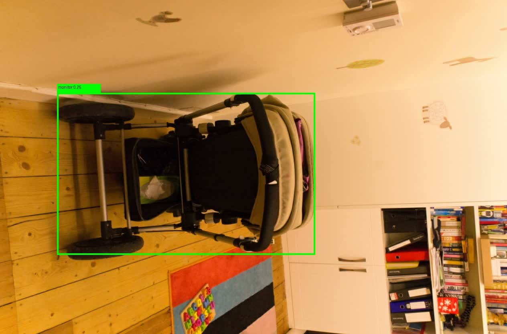

## Demo

**Open-vocabulary detection result** (prompt: `"dell monitor"`):



<video src="assets/detect_dell_monitor.mp4" controls width="600"></video>

**Gaussian scene trajectory:**

<video src="assets/gaussian_scene.mp4" controls width="600"></video>

# V-GREP3D — Open-Vocabulary Object Detection in 3D Gaussian Splatting Scenes

V-GREP3D is an experimental pipeline for **open-vocabulary object localization** inside photorealistic 3D Gaussian Splatting (3DGS) reconstructions.

Given a natural-language query (e.g. `"dell monitor"`), the system:

1. Runs open-vocabulary 2D detection (Grounding DINO) on the original multi-view images used to train the Gaussian scene.
2. Produces per-frame bounding boxes with confidence scores.
3. (Future) Lifts consistent detections into a single 3D bounding volume that can be reprojected into novel views of the Gaussian field.

The current release implements **Stage 1** (multi-view 2D open-vocab detection + visualization). Stage 2 (3D lifting via rendered depth + multi-view aggregation) is under active development.

## Features

- Modal-based GPU execution (A10G)
- Compatible with standard `gsplat` checkpoints + COLMAP sparse reconstructions
- Open-vocabulary detection via `IDEA-Research/grounding-dino-tiny`
- Automatic generation of annotated video with boxes, labels, and confidence scores
- Designed for real-estate / indoor scene understanding use cases

## Repository Structure

## Quick Start (Detection)

```bash
# from repo root
modal run modal/run_detect.py \
  --scene playroom_test \
  --prompt "dell monitor" \
  --max-images 30
gaussian-outputs/<scene>/vgrep3d/detect/detect_<prompt>.mp4
Requirements

Modal account with GPU access
Pre-trained gsplat checkpoint + COLMAP sparse model uploaded to a Modal Volume named gaussian-outputs
Python ≥ 3.11 (local CLI only)

Citation / Inspiration
Built on top of:

gsplat
Grounding DINO
COLMAP
