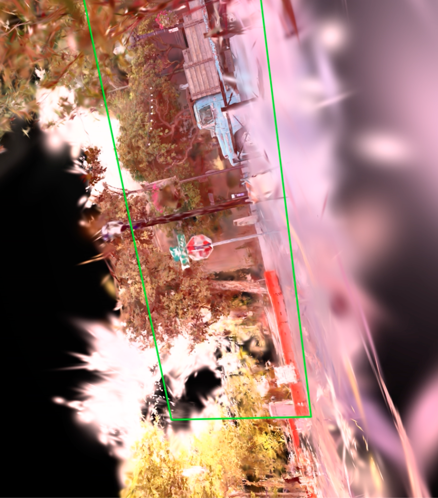
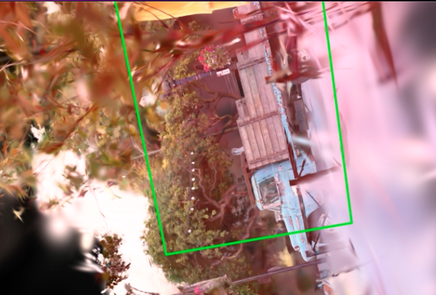
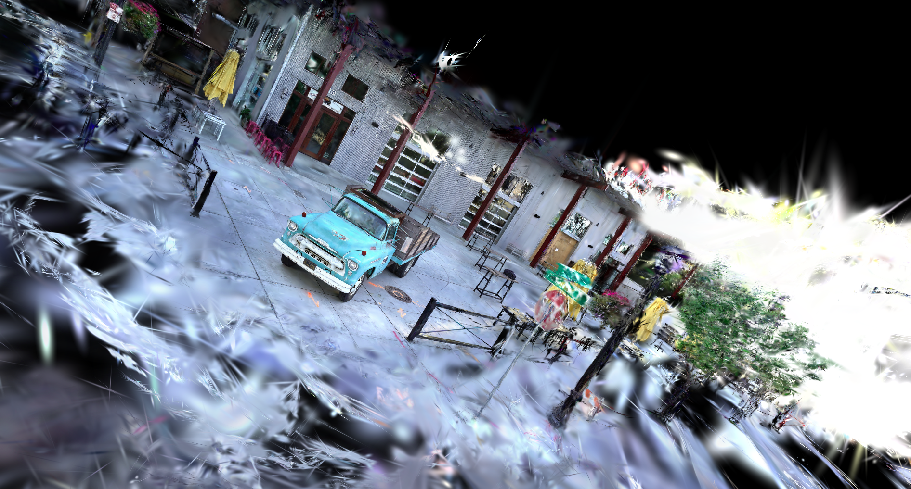
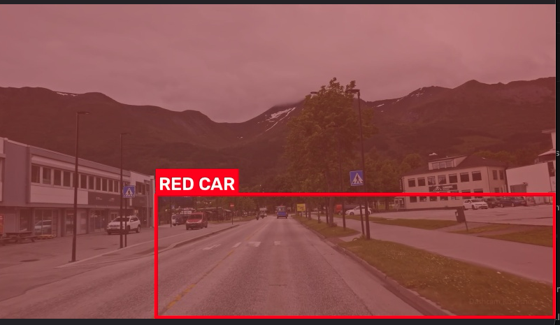
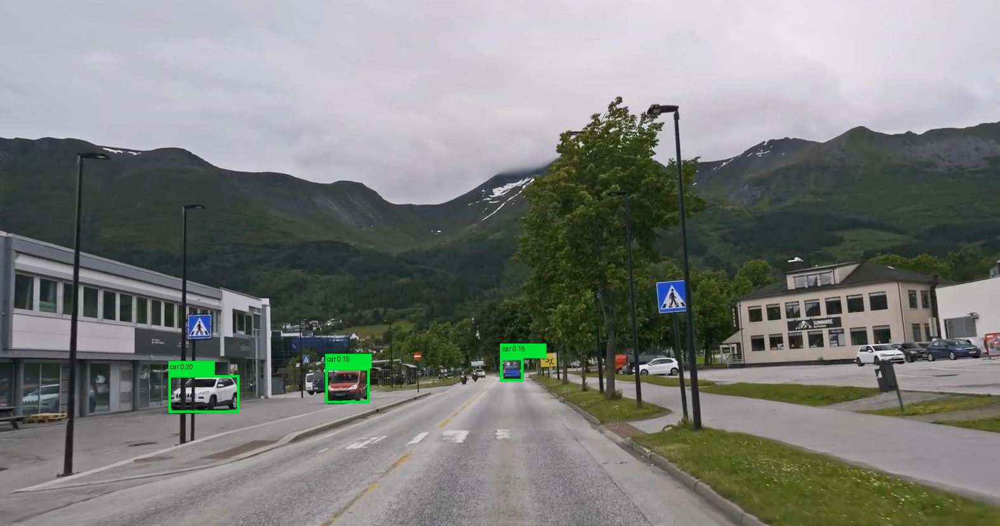

# vgrep3d — Open-Vocabulary 3D Object Detection in Gaussian Splat Scenes

> **Status: Open Problem.** This repository documents an honest attempt to build open-vocabulary 3D object detection inside Gaussian Splatting scenes using semantic feature fields. It works partially — and the parts that don't are documented so others can take it further.

---

## What This Is

vgrep3d is a pipeline that trains a **semantic feature field** over a 3D Gaussian Splatting scene, enabling open-vocabulary text queries ("red car", "stop sign", "motorcycle") to localize objects in 3D space. The approach is inspired by [LangSplat](https://langsplat.github.io/) and extends it with a SigLIP 2 encoder and per-scene autoencoder compression.

Given a set of posed images and a trained Gaussian Splat, the system:
1. Extracts per-image SigLIP 2 features (ViT-SO400M-14-SigLIP-384, 1152-dim)
2. Trains a compact per-scene autoencoder (1152 → 16-dim latents)
3. Distills a **feature field** — assigning a 16-dim semantic latent to every Gaussian
4. At query time, encodes a text prompt and computes per-Gaussian cosine similarity
5. Returns a centroid, AABB, and support count in world coordinates

**The core insight**: semantic meaning is embedded directly into each Gaussian, enabling viewpoint-invariant object grounding without any 2D detection overhead.

---

## The Problem We Ran Into

The pipeline produces correct **scene-level** semantic understanding but struggles with **object-level localization** for two reasons:

### 1. Dashcam data has poor view diversity
The driving scene was captured from a single forward-facing dashcam. With ~292 frames all from roughly the same forward-facing vantage point, the Gaussian feature field doesn't develop enough per-object separation to localize tight bounding boxes. The optimizer can only push Gaussians apart along directions that are contrastive across the training views — with near-identical viewpoints, there is no gradient pressure to separate Gaussians that are spatially distinct but visually similar from this angle. A scene captured with 360° coverage (walking around objects) would yield significantly better results.

### 2. SigLIP 2 crop-level embeddings are semantically flat in driving scenes

> **Note:** This is *not* a "we used image-level features" problem. The pipeline uses SAM automatic segmentation to decompose each frame into individual mask crops, which are then embedded separately by SigLIP 2. We verified this directly from the cached feature files: a representative frame (frame 0150) contains **92 distinct SAM masks**, each with its own 1152-dim embedding.

The actual failure: SigLIP 2's image tower was trained for whole-image captioning alignment. When given a cropped fragment of a driving scene — a car door, a road surface patch, part of a building — the embeddings for visually distinct regions land in a compact cluster of the 1152-dim space. There is simply not enough inter-class separation in SigLIP 2 crop embeddings for driving-scene fragments to give the distillation objective a strong training signal. The result is that per-Gaussian relevance for any given text query is high for a large fraction of Gaussians (e.g., ~69% for "red car"), making tight spatial filtering impossible regardless of how good the AABB-fitting heuristics are.

### What actually works
- ✅ Semantic heatmaps rendered from novel viewpoints
- ✅ Correct relevance ranking (road > sky, car > building for car queries)  
- ✅ Centroid localization (correct hemisphere of the scene)
- ✅ Full pipeline: COLMAP → gsplat → SAM feature extraction → autoencoder → field distillation → query
- ❌ Tight per-object 3D bounding boxes (loose, scene-spanning AABBs)
- ❌ Instance-level separation between similar objects (red car vs white car overlap heavily)

---

## Workaround: 2D Detection + 3D Backprojection

Since tight 3D boxes from the feature field alone weren't achievable, we explored a hybrid approach:

1. **Grounding DINO** detects objects in the original 2D images with tight boxes
2. Camera intrinsics + Gaussian depth → lift 2D boxes to 3D Gaussian clusters
3. Fit AABB to the 3D cluster → inject as wireframe Gaussians into the PLY
4. Load in SuperSplat to see labeled 3D bounding boxes in gaussian space

This works but is architecturally separate from the feature field — it's 2D detection dressed up in 3D, not true 3D semantic understanding.

---

## How to Actually Solve This (Open Problem)

If you want tight per-object 3D boxes from a semantic Gaussian field with dashcam-style data, you likely need one or more of:

1. **Better capture data** — capture scenes with cameras orbiting objects, not just driving past them. A 360° rig or Polycam-style walkthrough dramatically improves per-Gaussian separability. This is the single highest-impact change.
2. **Instance-level vision-language models** — features from DINOv2 (self-supervised, patch-level), CLIP with dense patch tokens, or models specifically trained on crop/fragment alignment may embed driving-scene regions more discriminatively than SigLIP 2's image-caption tower.
3. **Instance-contrastive distillation** — instead of per-pixel cosine loss against SigLIP targets, add a contrastive term that pulls same-object Gaussians together and pushes different-object Gaussians apart (similar to SAGA or Gaussian Grouping).
4. **Spatial clustering as post-processing** — after computing per-Gaussian relevance, apply DBSCAN to find the densest spatial cluster (we tried this — it helps but doesn't fully solve it when the underlying embedding space is flat across scene regions).

---

## Results Gallery

**Gaussian splat with stop sign detection (green box):**


**Gaussian splat with blue truck detection:**


**Full scene render (truck scene):**


**Semantic heatmap — "red car" query on driving scene:**


**Grounding DINO 2D detection (fallback/workaround):**


---

## Setup

### Requirements
- Modal account (for GPU compute)
- Python 3.11+
- COLMAP (for SfM reconstruction)

```bash
pip install modal gsplat open-clip-torch transformers plyfile opencv-python
modal setup
```

### Pipeline

```bash
# 1. Upload images and run COLMAP + gsplat training
modal run modal/run_gsplat_train.py --scene your_scene --images /path/to/images

# 2. Build the semantic feature field
modal run modal/run_index.py::index --scene your_scene --epochs 30

# 3. Query in 3D
modal run modal/run_index.py::query --scene your_scene --prompt "red car"

# 4. Render semantic heatmap video
modal run modal/heatmap.py --scene your_scene --prompt "red car"

# 5. 2D detection on original images (Grounding DINO)
modal run modal/run_detect.py --scene your_scene --prompt "car" --max-images 30

# 6. Export gaussian PLY for SuperSplat viewer
modal run scripts/convert_ply.py --scene your_scene
```

---

## Results

### Driving Scene (683,644 Gaussians, 292 frames)

| Query | Support (Gaussians) | Centroid |
|-------|-------------------|---------|
| red car | 473,054 | (-0.35, 0.37, 0.14) |
| white car | 409,718 | (-0.49, 0.25, 0.14) |
| stop sign | 205,819 | (-0.35, 0.24, 0.02) |
| yellow sign | 89,593 | (-0.27, -0.03, 0.03) |
| motorcycle | 193,710 | (-0.21, 0.30, 0.05) |

Support counts are large relative to scene size — this is the scene-level matching problem described above.

### What the feature field gets right

The **relevance ordering** is semantically correct: yellow sign activates far fewer Gaussians than red car (89k vs 473k), consistent with it being a smaller, more distinctive object. The centroids are in the correct hemisphere of the scene. The semantic heatmap renders show clear activation differences between queries.

---

## Repository Structure

```
vgrep3d/
├── modal/
│   ├── run_index.py          # Main pipeline: index + query
│   ├── run_detect.py         # 2D Grounding DINO detection
│   ├── run_gsplat_train.py   # COLMAP + gsplat training
│   ├── run_export_highlight.py
│   ├── run_export_box.py
│   ├── run_visualize.py
│   └── run_vgrep3d.py
├── scripts/
│   ├── convert_ply.py        # Export checkpoint → viewable PLY
│   ├── label_scene.py        # Inject wireframe bbox Gaussians
│   ├── heatmap.py            # Render semantic heatmap video
│   ├── annotate.py           # Annotate best heatmap frame
│   └── snapshot.py           # Best-view snapshot with 2D box
├── src/
│   └── vgrep3d/
│       ├── field/
│       │   ├── autoencoder.py    # FeatureAutoencoder (1152→16)
│       │   ├── feature_field.py  # FeatureField
│       │   ├── train.py          # Field distillation training
│       │   └── colmap_io.py      # COLMAP binary readers
│       ├── query/
│       │   └── query.py          # Query3D: relevance + locate_3d
│       └── preprocess/
│           └── features.py       # SigLIP feature extraction
├── assets/
│   ├── gaussian_stop_sign.jpg
│   ├── gaussian_blue_truck.jpg
│   ├── full_splat.jpg
│   ├── heatmap_red_car.jpg
│   └── grounding_dino_cars.jpg
└── README.md
```

---

## Key Design Decisions

### Why SigLIP 2?
SigLIP 2 (ViT-SO400M-14-SigLIP-384) outperforms CLIP on dense visual understanding tasks and produces 1152-dim features that encode richer spatial semantics. This matters for distinguishing objects that are spatially close (red car vs white car on the same road).

### Why a per-scene autoencoder?
Storing 1152-dim SigLIP features for 683k Gaussians requires ~3GB. A per-scene autoencoder compresses to 16-dim latents (~43MB) with minimal semantic loss — the compression only needs to be lossless *for the objects present in this scene*, so a tiny bottleneck generalizes well.

### Why Modal + A10G?
The feature field distillation trains a neural field over the Gaussian scene, requiring CUDA for both gsplat rasterization and gradient computation. A10G GPUs provide 24GB VRAM, sufficient for scenes up to ~1M Gaussians.

---

## Citation / Attribution

If you build on this work:

```bibtex
@misc{vgrep3d2026,
  author = {Ryan Abraham},
  title  = {vgrep3d: Open-Vocabulary 3D Object Detection in Gaussian Splat Scenes},
  year   = {2026},
  url    = {https://github.com/ryamabra/vgrep3d}
}
```

Core dependencies:
- [gsplat](https://github.com/nerfstudio-project/gsplat) — Gaussian Splatting rasterization
- [open_clip](https://github.com/mlfoundations/open_clip) — SigLIP 2 encoder
- [Grounding DINO](https://github.com/IDEA-Research/GroundingDINO) — 2D open-vocabulary detection
- [SuperSplat](https://supersplat.playcanvas.com) — 3D Gaussian viewer

---

## Contributing

This is an open problem. PRs welcome, especially around:
- Instance-aware feature distillation
- SAM-guided mask feature extraction  
- Better 3D box fitting from feature field outputs
- Multi-view consistent object grounding
